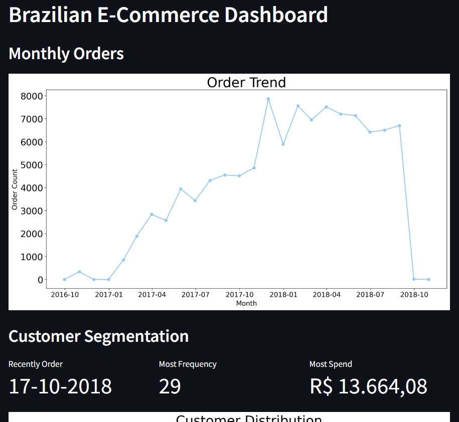

# Setup Environtment

pip install numpy pandas scipy matplotlib seaborn jupyter streamlit babel

# Run Dashboard

streamlit run dashboard.py

# Streamlit Cloud

https://ecommerce-trend-rfm-analysis.streamlit.app/

